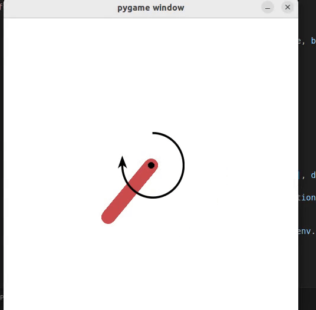

# A2C
Actor Critic Algorithm


## 🌀 Rollout Demo




## Algorithm

Train the Actor and Critic networks simultaneously.

- Actor Network : A policy network that outputs the mean and standard deviation of the policy's probability distribution.
- Critic Network : A value network that estimates the state value function and is used to compute the loss for training the actor.

## Concept

정책을 $\theta$ 로 파라미터화 한 네트워크로 정의한다. 이때 최적의 $\theta$ 를 찾기 위해서 Loss Function 을 정의하고, 이를 최적화 하기 위한 학습을 진행한다.

이때 Loss Function은 Policy 와 Action Value(행동가치, Q)로 구성된다. 그러나 이 Loss Function을 그대로 사용하면 행동가치의 변화에 Loss 가 매우 민감해져 학습에 불안정성을 야기할 수 있다. 따라서 Base Line을 빼주어 학습 안정성을 높인다.

이때 Base Line 은 보통 State Value 를 사용하고, 적절한 근사를 거치면 Policy 의 Loss Function이 State Value Function 과 Policy 의 조합으로 나타난다.

이때 State Value Function 또한 $\phi$ 로 파라미터화한 네트워크로 정의하고, 이를 Critic Network라고 하면, Critic Network 로 State Value 를 계산하고, 이를 Actor Network 를 학습하는데 재사용하며 최적의 Policy Network 를 찾을 수 있다.

## How to Run?
### Train
```
cd rl_colddeuu/a2c
python3 a2c_main.py
```

### Run
```
cd rl_colddeuu/a2c
python3 a2c_agent_test.py
```

### Plot

```
Run reward_plot.mlx in MATLAB
```
